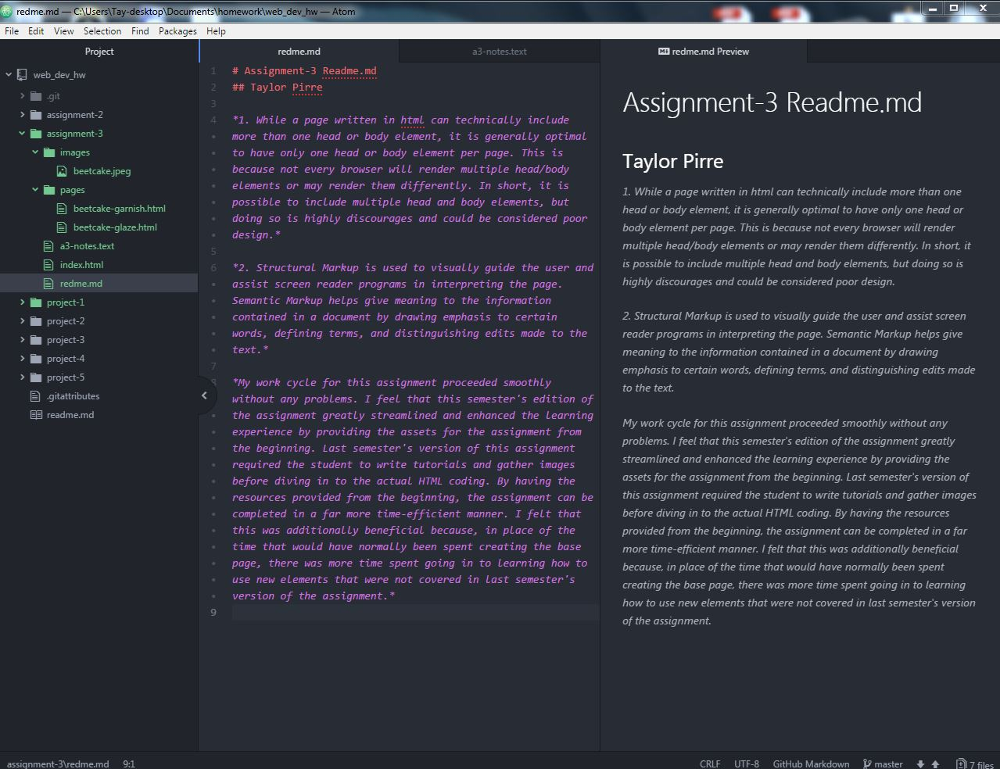

# Assignment-3 Readme.md
## Taylor Pirre

*1. While a page written in html can technically include more than one head or body element, it is generally optimal to have only one head or body element per page. This is because not every browser will render multiple head/body elements or may render them differently. In short, it is possible to include multiple head and body elements, but doing so is highly discourages and could be considered poor design.*

*2. Structural Markup is used to visually guide the user and assist screen reader programs in interpreting the page. Semantic Markup helps give meaning to the information contained in a document by drawing emphasis to certain words, defining terms, and distinguishing edits made to the text.*

*My work cycle for this assignment proceeded smoothly without any problems. I feel that this semester's edition of the assignment greatly streamlined and enhanced the learning experience by providing the assets for the assignment from the beginning. Last semester's version of this assignment required the student to write tutorials and gather images before diving in to the actual HTML coding. By having the resources provided from the beginning, the assignment can be completed in a far more time-efficient manner. I felt that this was additionally beneficial because, in place of the time that would have normally been spent creating the base page, there was more time spent going in to learning how to use new elements that were not covered in last semester's version of the assignment.*

