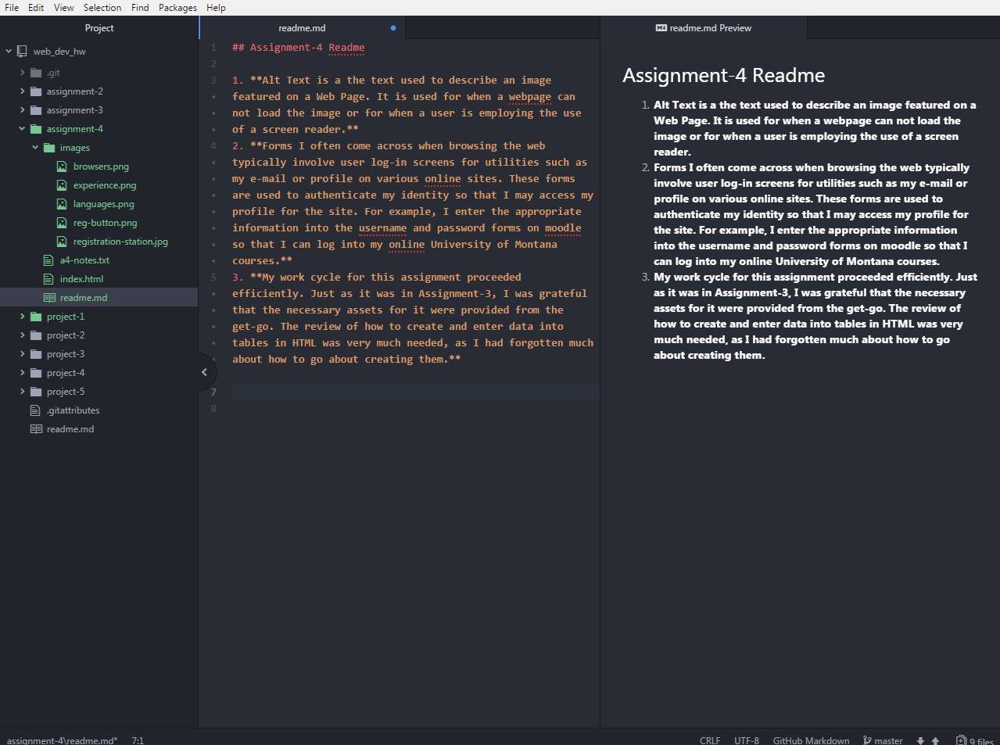

## Assignment-4 Readme

1. **Alt Text is a the text used to describe an image featured on a Web Page. It is used for when a webpage can not load the image or for when a user is employing the use of a screen reader.**
2. **Forms I often come across when browsing the web typically involve user log-in screens for utilities such as my e-mail or profile on various online sites. These forms are used to authenticate my identity so that I may access my profile for the site. For example, I enter the appropriate information into the username and password forms on moodle so that I can log into my online University of Montana courses.**
3. **My work cycle for this assignment proceeded efficiently. Just as it was in Assignment-3, I was grateful that the necessary assets for it were provided from the get-go. The review of how to create and enter data into tables in HTML was very much needed, as I had forgotten much about how to go about creating them.**

