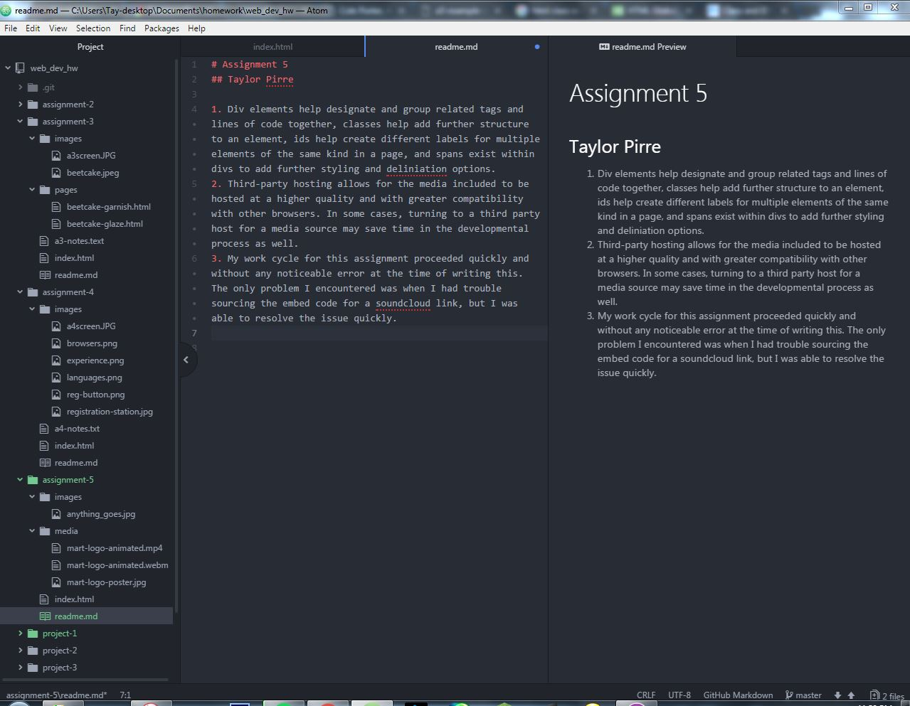

# Assignment 5
## Taylor Pirre

1. Div elements help designate and group related tags and lines of code together, classes help add further structure to an element, ids help create different labels for multiple elements of the same kind in a page, and spans exist within divs to add further styling and deliniation options.
2. Third-party hosting allows for the media included to be hosted at a higher quality and with greater compatibility with other browsers. In some cases, turning to a third party host for a media source may save time in the developmental process as well.
3. My work cycle for this assignment proceeded quickly and without any noticeable error at the time of writing this. The only problem I encountered was when I had trouble sourcing the embed code for a soundcloud link, but I was able to resolve the issue quickly.

