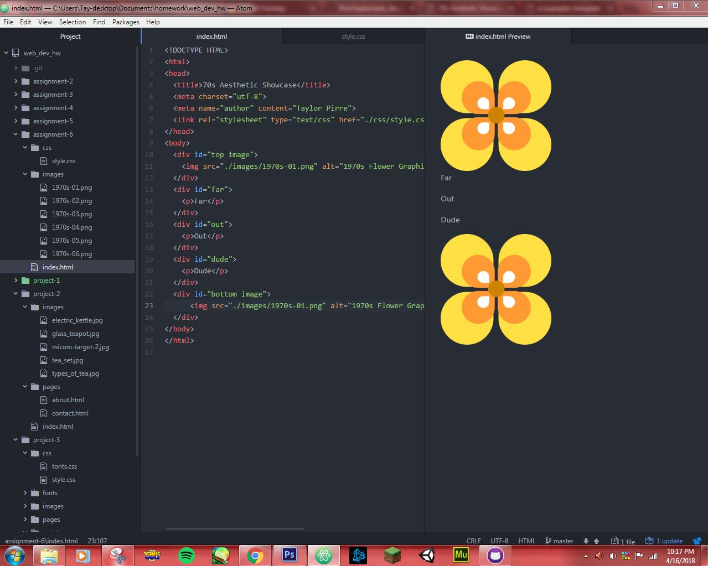

## Assignment 6 Readme
# Taylor Pirre

**For this project, I chose to work with the graphics from the 1970s set. Utilizing the flower graphic from the set as a starting point, I then picked out a color palette that incorporated the warm orange, brown, and yellow shades that were popular in design during the time period.**

**The hexidecimal codes of the main colors I chose to work with were:**

1. #ffcc33
2. #ff9933
3. #663300

**The work cycle for this lesson proceeded with little hindrance for the most part, and it was good to have a second chance to better understand the basics of CSS. I feel like I picked up a bit more understanding on the fundamentals of how CSS works this time around that I had not quite gotten the hang of last semester. The only error encountered was that once I added in color and set the sizes for the individual div containers, they lost their center allignment. I am going to work on it a bit more after I upload this readme, so there is a small chance that this error may be absent from the final version of this assignment.**

