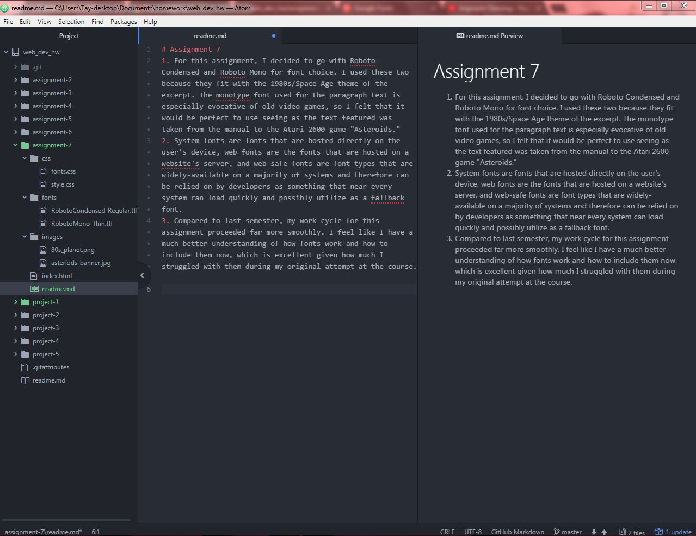

# Assignment 7
1. For this assignment, I decided to go with Roboto Condensed and Roboto Mono for font choice. I used these two because they fit with the 1980s/Space Age theme of the excerpt. The monotype font used for the paragraph text is especially evocative of old video games, so I felt that it would be perfect to use seeing as the text featured was taken from the manual to the Atari 2600 game "Asteroids."
2. System fonts are fonts that are hosted directly on the user's device, web fonts are the fonts that are hosted on a website's server, and web-safe fonts are font types that are widely-available on a majority of systems and therefore can be relied on by developers as something that near every system can load quickly and possibly utilize as a fallback font.
3. Compared to last semester, my work cycle for this assignment proceeded far more smoothly. I feel like I have a much better understanding of how fonts work and how to include them now, which is excellent given how much I struggled with them during my original attempt at the course.

