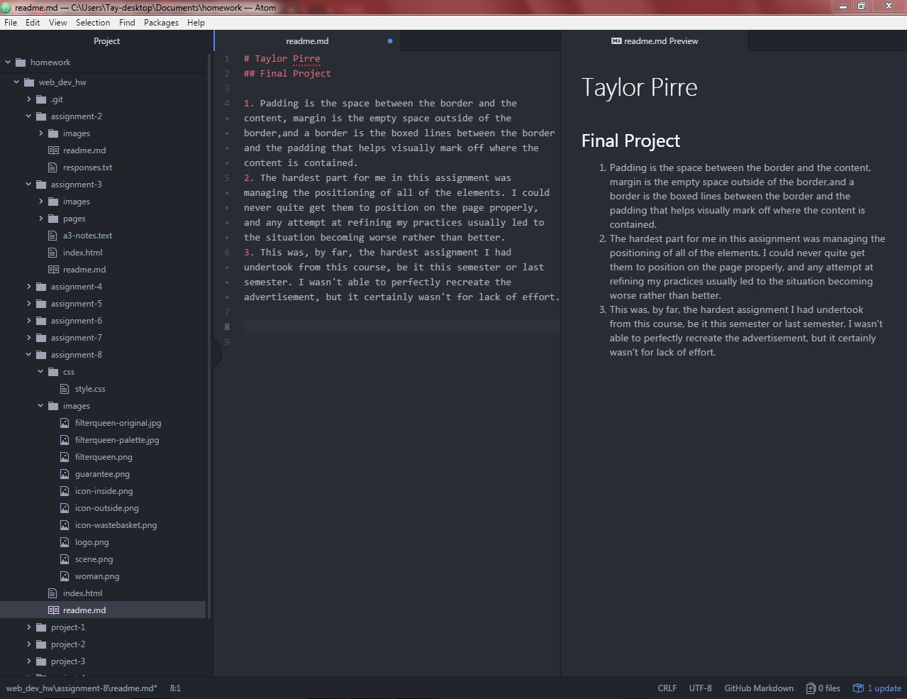

# Taylor Pirre
## Final Project

1. Padding is the space between the border and the content, margin is the empty space outside of the border,and a border is the boxed lines between the border and the padding that helps visually mark off where the content is contained.
2. The hardest part for me in this assignment was managing the positioning of all of the elements. I could never quite get them to position on the page properly, and any attempt at refining my practices usually led to the situation becoming worse rather than better.
3. This was, by far, the hardest assignment I had undertook from this course, be it this semester or last semester. I wasn't able to perfectly recreate the advertisement, but it certainly wasn't for lack of effort.

