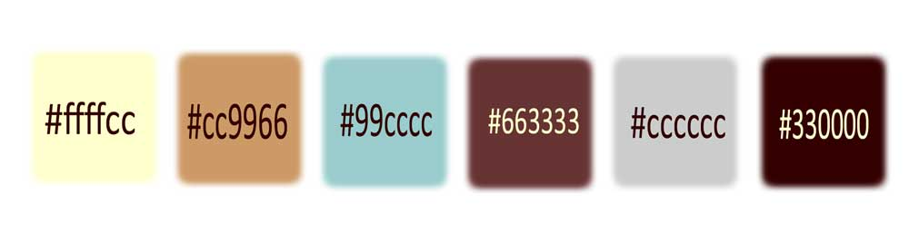
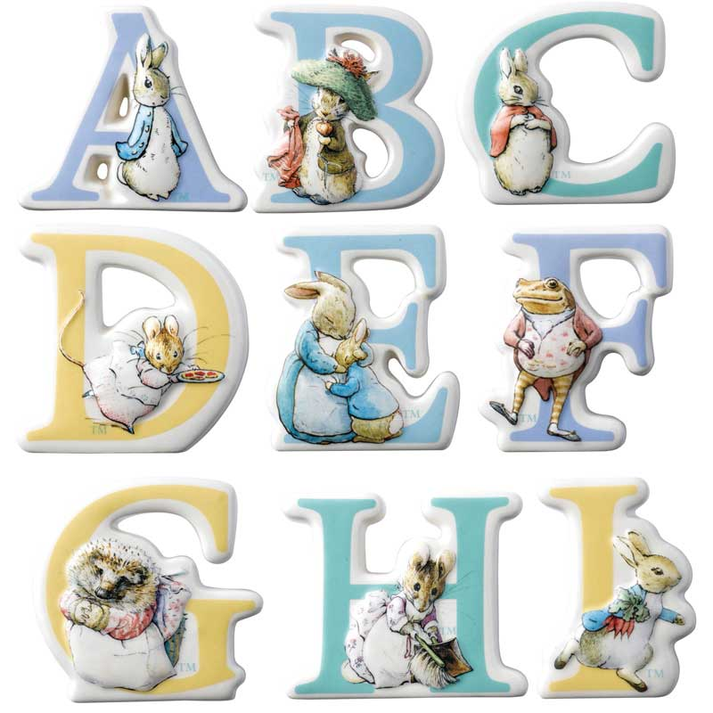
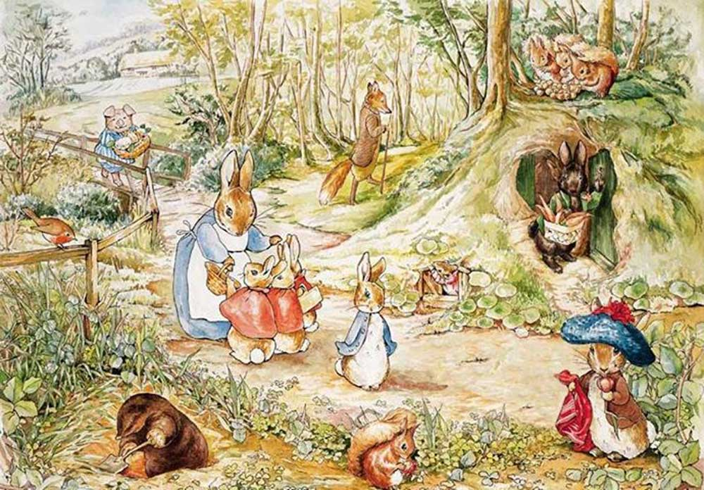
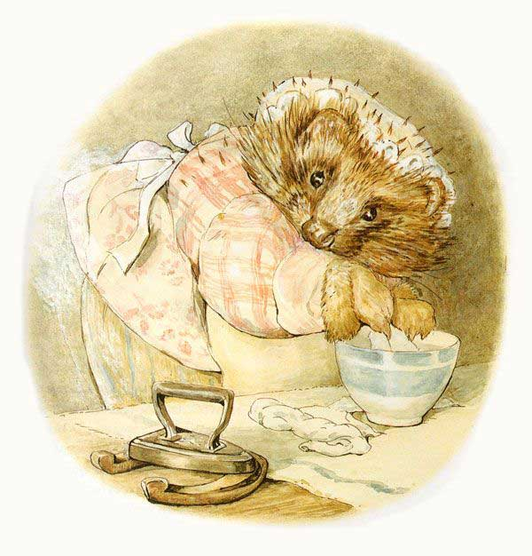
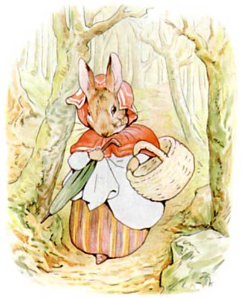
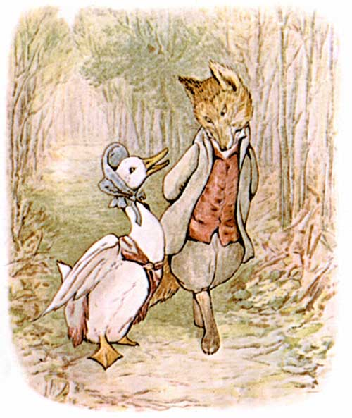

## Homework 04
---

---
Style Plan:

1. For this site, I will be creating a book showcase.
2. The book I will feature is ***The Complete Tales of Beatrix Potter*** as compiled by Frederick Warne. My sample will be an except from her most well-known story, *The Tale of Peter Rabbit*:

  "But Peter, who was very naughty, ran straight away to Mr. McGregor's garden, and squeezed under the gate!"

  "First he ate some lettuces and some French beans; and then he ate some radishes."

  "But round the end of a cucumber frame, whom should he meet but Mr. McGregor!"

  "Mr McGregor was on his hands and knees planting young cabbages, but he jumped up and ran after Peter, waving the rake and calling out 'Stop Thief!'"

  "Peter was most dreadfully frightened; he rushed all over the garden, for he had forgotten the way back to the gate.
  He lost one of his shoes among the cabbages, and the other shoe amongst the potatoes.
  After losing them, he ran on four legs and went faster, so that I think he might have got away altogether if he had not unfortunately run into a gooseberry net, and got caught by the large buttons on his jacket."

3. I will cite this short biography for Beatrix Potter found on [beatrixpottersociety.org.uk](https://beatrixpottersociety.org.uk/about-beatrix/) .

4. This is the color palette I plan on using for the site:

5. Here are some images that will serve as the inspiration for the site's design:

---
## Homework 05
---

---
## Homework 06
---

---
